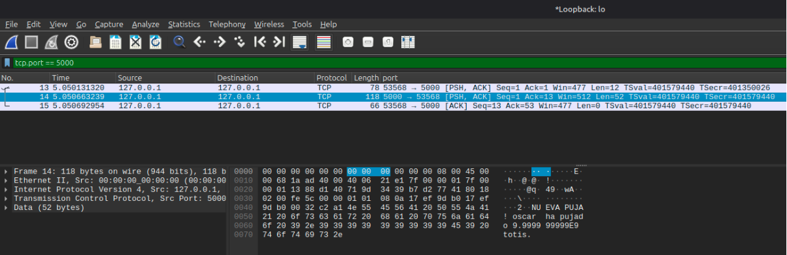

# **Escanea el tránsito de paquetes en la red con Wireshark y muestra la información intercambiada entre el cliente y el servidor a través del protocolo implementado.**

En esta fase inicial, se procedió a interceptar el tránsito de paquetes para analizar la comunicación entre el cliente y el servidor bajo el protocolo original. El objetivo es demostrar la falta de seguridad de las transmisiones en texto plano, las cuales exponen la información a cualquier observador en la red.

## **Pasos para la realización de la prueba**  
Primeramente, se debe iniciar la **aplicación servidor y un cliente** en un entorno de pruebas local *(‘localhost’).* Ya que para que haya una comunicación entre dos usuarios/máquinas, debe de estar conectadas entre sí. He usado el puerto 5000 para alojar el servidor, y los clientes se conectarán a este.

Luego, se configura la app **Wireshark** para interceptar el tráfico en la interfaz de bucle local **(Loopback / lo0).** Aquí podremos interceptar todos los paquetes que se comunican en la red interna del ordenador. Se aplicó el filtro de red ***tcp.port \== 5000*** (puerto del servidor) para aislar exclusivamente los paquetes de la subasta.

Como se puede observar en el flujo TCP extraído por Wireshark, el contenido de la comunicación es **completamente** legible(aposté como 99999999999..., por eso se ve en notación cientifica). Se distinguen con claridad parámetros sensibles como el nombre del postor, los montos de las pujas y las notificaciones del servidor.

Al carecer de cifrado, el sistema incumple los principios básicos de seguridad en la transmisión de información. Cualquier atacante posicionado en la misma red podría ejecutar un ataque de intermediario (**Man-in-the-Middle**) o realizar espionaje pasivo (**Sniffing**) para comprometer la integridad y privacidad de la subasta en texto plano.