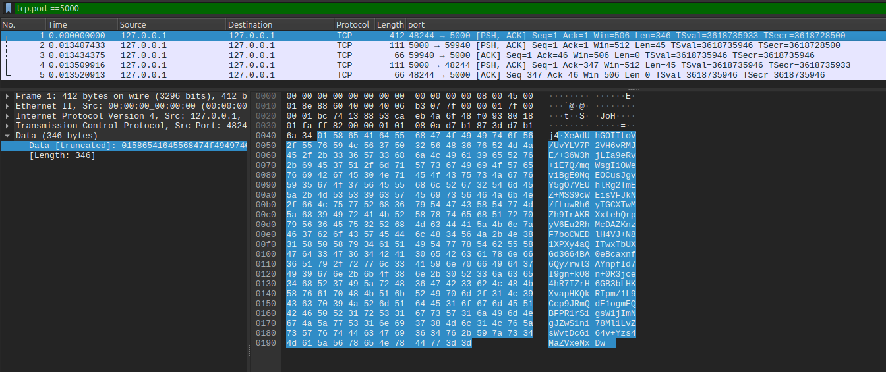

# 4. Muestra capturas de pantalla de Wireshark con otro intercambio de información en el que la información no sea legible.

Tras la integración del algoritmo RSA, se ha realizado una segunda auditoría de red interceptando los paquetes con Wireshark para verificar que la información sensible ya no es legible por terceros.

## Metodología de la comprobación

Se han seguido los mismos pasos que en la auditoría inicial:

1. Ejecución del servidor y conexión de un cliente postor.
2. Interceptación en la interfaz _Loopback_ con el filtro `tcp.port == 5000`.

## Evidencia: Tráfico cifrado e incomprensible

Al inspeccionar el tráfico después de aplicar las medidas de seguridad, el resultado es radicalmente distinto al del primer ejercicio. Como se observa en la captura de pantalla:

### Análisis de los resultados

Como se puede apreciar, los mensajes enviados desde el cliente (nombres y pujas) ya no aparecen en texto plano. En su lugar, el interceptor solo obtiene cadenas de texto codificadas en **Base64** que representan el contenido cifrado mediante el algoritmo **RSA**.

Sin acceso a la **Clave Privada** (la cual nunca sale de la memoria volátil del servidor), es matemáticamente inviable para un atacante reconstruir el mensaje original. Esto confirma que hemos mitigado con éxito las vulnerabilidades de:

- **Sniffing:** El contenido de la subasta es privado.
- **Suplantación de identidad:** Al estar el nombre cifrado desde el origen, un atacante no puede inyectar mensajes haciéndose pasar por el usuario legítimo sin romper el cifrado.

## Conclusión de la fase de auditoría

La transición de un protocolo de texto plano a uno cifrado asimétricamente garantiza la **Confidencialidad** y la **Integridad** de la subasta. El sistema ahora cumple con los estándares básicos de comunicación segura en red, protegiendo los intereses tanto de la casa de subastas como de los postores.

[Volver](../../../../../README.md)